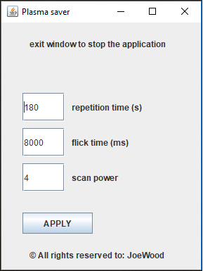

# Plasma-Saver

This little project of mine has mostly learning and sentimental value and isn't really practical.
Long story short, I got an old plasma tv, which could get damaged, if some stationary pixels are left for too long.
I am too lazy to keep switching the TV off so I made this little program to keep refreshing the screen.

